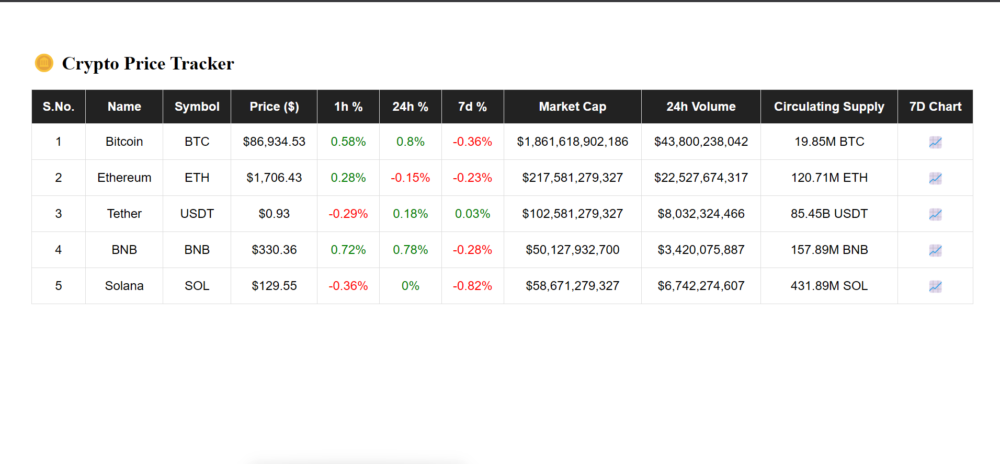

## 📸 Demo Screenshot



# 📈 Real-Time Crypto Price Tracker

A responsive React + Redux Toolkit app that simulates real-time crypto price tracking with live updates every 2 seconds.

## 🛠️ Tech Stack
- React (Vite)
- Redux Toolkit
- CSS (Responsive Table)
- Simulated WebSocket (setInterval)

## 📊 Features
- 5 crypto assets with live-updating:
  - Price
  - 1h, 24h, 7d % change
  - Market Cap, Volume, Supply
- Color-coded percentage changes (Green/Red)
- Fully managed by Redux state
- Mobile-friendly responsive table

## 🚀 Setup Instructions

```bash
git clone https://github.com/your-username/crypto-tracker.git
cd crypto-tracker
npm install
npm run dev
